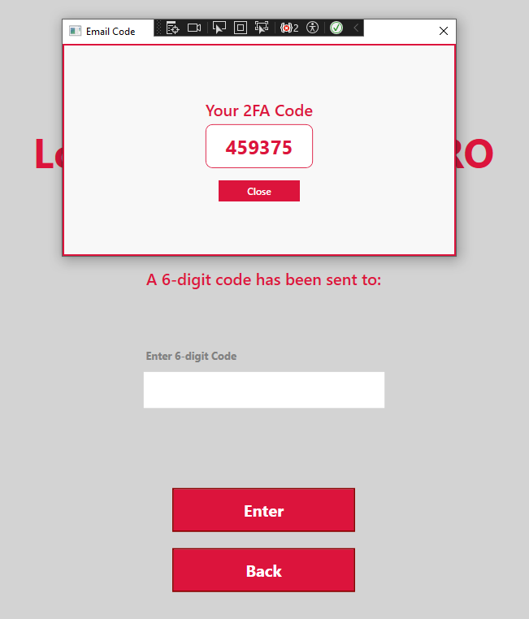

# Fit Tracker PRO – Fitness Tracking Desktop App

Fit Tracker PRO is a fitness tracking desktop application developed in C# and WPF, built as part of a portfolio project to showcase my skills in desktop application development and UI design. The app allows users to register, log in, manage workouts (cardio and strength), and update their account details. Special features include filtering workouts, 2FA for password reset, and dynamic data binding via the MVVM architecture.

## Getting Started

To run the application locally:

1. Open the solution file `Fit_Track_App.sln` in Visual Studio.
2. Ensure that the `DataManagement` folder and all project dependencies are correctly configured.
3. Press `F5` or click the **Start** button to launch the app.

## Purpose and Objectives

This project aims to demonstrate a modern, user-friendly fitness tracking application using the MVVM pattern in WPF. The app is designed to exercise key skills including:

- Desktop application development with WPF and XAML
- MVVM architecture with data binding and property change notifications
- UI/UX design with reusable styles and responsive layouts
- Command pattern implementation for interactive features
- Application of C# best practices and SOLID principles

## Technologies and Architecture

The application is built using:

- **C# with WPF** (Windows Presentation Foundation)
- **MVVM** architecture with `RelayCommand` for command handling
- `ObservableCollection` and `ICollectionView` for dynamic data binding
- Custom `Validator` class for input validation
- Singleton ViewModels (`UserViewModel`, `WorkoutViewModel`) for global state management
- Password handling using event-based `PasswordBox` bindings
- Custom converters for visibility and dynamic error messages
- Resource dictionaries for consistent styling
- `.sln` file structure in Visual Studio

## Functionality and Design Decisions

- **Start Page:** Landing screen with navigation to login or registration
- **Registration Page:** User registration with validation for username, email, password, and country
- **Login Page:** User login with 2FA support for password reset
- **Workouts Page:** Display, filter, add, edit, and delete workouts
- **User Details Page:** Manage profile details and change password
- **2FA Password Reset:** Generate and validate 6-digit codes with expiry
- **Modular Styling:** Styles defined in SCSS (or resource dictionaries)
- **Admin Functionality:** Toggle for admin-specific features (UI only)
- **Responsive Layouts:** XAML with dynamic grids and converters for visibility toggling

Special attention was given to maintain a clean separation of concerns via the MVVM architecture. Although basic in functionality, the app lays a strong foundation for scalability and potential feature expansion.

## Challenges and Lessons Learned

Building a fully functional WPF application with MVVM taught me the intricacies of data binding, UI responsiveness, and managing application state. Implementing password change functionality required understanding of the `PasswordBox` limitations and the necessity of event handlers for secure password management.

Handling 2FA codes, user session management, and dynamic filters with `ICollectionView` deepened my understanding of advanced WPF data binding. With more time, I would integrate a proper backend service and authentication tokens for enhanced security, plus add unit testing and dependency injection for easier maintenance and testing.

## Conclusion

This project demonstrates my ability to build a feature-rich desktop application with clean architecture and solid technical foundations. It highlights my skills in MVVM, WPF, data binding, and UI design while also emphasizing user-friendly error handling and state management. I look forward to building on this project and using the experience gained for future desktop applications.

## Gallery

---

# Fit Tracker PRO – Fitness Tracker Desktopapp (Svenska)

Fit Tracker PRO är en desktopapplikation utvecklad i C# och WPF, skapad som en del av en portfölj för att visa mina färdigheter inom desktoputveckling och UI-design. Applikationen låter användare registrera sig, logga in, hantera träningspass (kondition och styrka) samt uppdatera sina kontouppgifter. Särskilda funktioner inkluderar filtrering av träningspass, 2FA för lösenordsåterställning och dynamisk datavisning via MVVM-arkitektur.

## Kom igång

För att köra applikationen lokalt:

1. Öppna lösningsfilen `Fit_Track_App.sln` i Visual Studio.
2. Kontrollera att `DataManagement`-mappen och alla projektberoenden är korrekt konfigurerade.
3. Tryck på `F5` eller klicka på **Starta** för att köra appen.

## Syfte och mål

Projektet syftar till att visa upp en modern, användarvänlig fitnessapplikation byggd med MVVM i WPF. Applikationen tränar viktiga färdigheter såsom:

- Desktoputveckling med WPF och XAML
- MVVM-arkitektur med databindning och property change notifications
- UI/UX-design med återanvändbara stilar och responsiva layouter
- Kommandomönster för interaktiva funktioner
- Tillämpning av C#-best practices och SOLID-principer

## Teknologier och arkitektur

Applikationen är byggd med:

- **C# med WPF** (Windows Presentation Foundation)
- **MVVM**-arkitektur med `RelayCommand` för kommandohantering
- `ObservableCollection` och `ICollectionView` för dynamisk databindning
- Egen `Validator`-klass för inputvalidering
- Singleton ViewModels (`UserViewModel`, `WorkoutViewModel`) för global state management
- Hantering av lösenord via event-baserad `PasswordBox`-bindning
- Egna konverterare för visibility och dynamiska felmeddelanden
- Resource dictionaries för konsekvent styling
- `.sln`-filstruktur i Visual Studio

## Funktionalitet och designval

- **Startsida:** Landningssida med navigation till login eller registrering
- **Registreringssida:** Användarregistrering med validering för användarnamn, e-post, lösenord och land
- **Inloggningssida:** Inloggning med stöd för 2FA-lösenordsåterställning
- **Träningssida:** Visa, filtrera, lägg till, redigera och ta bort träningspass
- **Kontosida:** Hantera profiluppgifter och byt lösenord
- **2FA Återställning:** Generera och validera 6-siffriga koder med utgångstid
- **Modulär styling:** Stilar definierade i SCSS (eller resource dictionaries)
- **Adminfunktioner:** Toggle för adminspecifika funktioner (endast UI)
- **Responsiva layouter:** XAML med dynamiska grids och konverterare för visibility

Särskild vikt har lagts på ren separation av ansvar via MVVM-arkitekturen. Även om appen är grundläggande i funktionalitet, ger den en stark grund för framtida vidareutveckling.

## Utmaningar och lärdomar

Att bygga en komplett WPF-applikation med MVVM lärde mig mycket om databindning, UI-responsivitet och hantering av applikationsstate. Implementeringen av lösenordsbytet krävde förståelse för `PasswordBox`-begränsningar och behovet av event handlers för säker lösenordshantering.

Att hantera 2FA-koder, användarsessioner och dynamiska filter med `ICollectionView` gav mig en djupare förståelse för avancerad databindning i WPF. Med mer tid hade jag velat integrera en riktig backend och autentiseringstokens för ökad säkerhet, samt lägga till enhetstester och dependency injection för enklare underhåll.

## Slutsats

Det här projektet visar min förmåga att bygga en funktionsrik desktopapplikation med ren arkitektur och gedigen teknisk grund. Det betonar mina färdigheter i MVVM, WPF, databindning och UI-design samt användarvänlig felhantering och state management. Jag ser fram emot att bygga vidare på detta projekt och använda erfarenheterna i framtida uppdrag.
